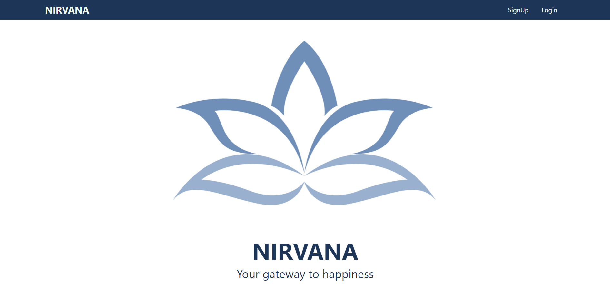

# Nirvana


## About Nirvana

- **Nirvana** is a web app aimed to provide happiness and motivation in times of despair and at any time.
- It reduces imposter syndrome by providing instances of time you've accomplished something or the tasks you've completed.
- It lets you pour your feelings out and reflect on your failures for improvement.

## Inspiration

- Self care plays an integral role in maintaining good physical health as well as mental health.
- Many people around the globe suffer imposter syndrome ( Impostor syndrome refers to an internal experience of believing that you are not as competent as others perceive you to be) which is mostly due to lack of self care and belief in one's self.
- According to research, few of the ways to overcome imposter syndrome include Getting honest, Focusing on facts (not feelings), Embracing the highlights.
- Inspired by the jar of emotions and happiness, our aim was to create a solution using these facts.

## Technologies Used

- React Js for frontend
- Node Js for backend
- Database Used - MongoDB
- Hosted ob heroku
- Git and Github collobration

## Dependencies
#### To Run file in console one must have following software
* git
  * For windows users [Download here](https://git-scm.com/download/win)
  * For Macintosh users type following command in terminal
      ```sh 
      brew install git
      ```
  * For Linux user type following command in terminal belonging to respective Linux distribution
    * Debian/Ubuntu
      *  For the latest stable version for your release of Debian/Ubuntu
       ```shell
       apt-get install git
       ```
      *  For Ubuntu, this PPA provides the latest stable upstream Git version
      ```shell
      add-apt-repository ppa:git-core/ppa 
      apt update; apt install git
      ```
<!--     * Fedora
       *  up to Fedora 21
          ```sh
           yum install git
           ```
       *  Fedora 22 and later
           ```sh
            dnf install git 
            ```
    * Gentoo
       ```sh
       emerge --ask --verbose dev-vcs/git
       ```
     * Arch Linux
       ```sh
        pacman -S git
       ```
     * openSUSE
       ```sh
        zypper install git
       ```
     * Mageia
       ```sh 
       urpmi git
       ```
    * Nix/NixOS
       ```sh
       nix-env -i git
       ```
    * FreeBSD
       ```sh
       pkg install git
       ```
    * Solaris 9/10/11 (OpenCSW)
       ```sh
        pkgutil -i git
       ```
    * Solaris 11 Express
       ```sh
        pkg install developer/versioning/git
       ```
    * OpenBSD
        ```sh
         pkg_add git
        ```
    * Alpine
       ```sh
        apk add git
       ```
    * Slitaz
       ```sh
        tazpkg get-install git
      ``` -->
* Node.js
   * For windows [32 bit version](https://nodejs.org/dist/v16.2.0/node-v16.2.0-x86.msi) 
   * for windows [64 bit version](https://nodejs.org/dist/v16.2.0/node-v16.2.0-x64.msi) 
   * For Macintosh [64 bit version](https://nodejs.org/dist/v14.17.0/node-v14.17.0.pkg ) 
   * For Linux [64 bit version](https://nodejs.org/dist/v14.17.0/node-v14.17.0-linux-x64.tar.xz) 
<!-- 
* For server:
package.json
```json
{
  "name": "server",
  "version": "1.0.0",
  "description": "server",
  "main": "server.js",
  "scripts": {
    "start": "node server",
    "server": "nodemon server",
    "client": "npm start --prefix client",
    "dev": "concurrently \"npm run server\" \"npm run client\"",
    "heroku-postbuild": "NPM_CONFIG_PRODUCTION=false npm install --prefix client && npm run build --prefix client"
  },
  "keywords": [],
  "author": "",
  "license": "ISC",
  "dependencies": {
    "axios": "^0.21.1",
    "bcryptjs": "^2.4.3",
    "cors": "^2.8.5",
    "dotenv": "^9.0.2",
    "express": "^4.17.1",
    "express-validator": "^6.11.1",
    "jsonwebtoken": "^8.5.1",
    "mongoose": "^5.12.10"
  },
  "devDependencies": {
    "concurrently": "^6.1.0",
    "nodemon": "^2.0.7"
  }
}
```
* For Client

```json
{
    "name": "client",
    "version": "0.1.0",
    "private": true,
    "dependencies": {
        "@testing-library/jest-dom": "^5.12.0",
        "@testing-library/react": "^11.2.7",
        "@testing-library/user-event": "^12.8.3",
        "axios": "^0.21.1",
        "react": "^17.0.2",
        "react-dom": "^17.0.2",
        "react-router-dom": "^5.2.0",
        "react-scripts": "4.0.3",
        "web-vitals": "^1.1.2",
        "zustand": "^3.5.1"
    },
    "scripts": {
        "start": "react-scripts start",
        "build": "react-scripts build",
        "test": "react-scripts test",
        "eject": "react-scripts eject"
    },
    "eslintConfig": {
        "extends": [
            "react-app",
            "react-app/jest"
        ]
    },
    "browserslist": {
        "production": [
            ">0.2%",
            "not dead",
            "not op_mini all"
        ],
        "development": [
            "last 1 chrome version",
            "last 1 firefox version",
            "last 1 safari version"
        ]
    }
}
```
-->
## Steps To Run

Please follow the following to run the application

1. Clone the repository to a location of your Desktop by using git comand
 ```sh
cd ~/Desktop/
git clone https://github.com/irsayvid/nirvana.git
```
2. Go to project folder by pressing following commands in terminal or shell
```sh
cd ~/Desktop
cd nirvana
```
3. Open the project in Visual Studio or any editor of your choice

4. Install all the dependencies using the following commands in both app and in directory client
```sh 
npm install
cd client 
npm install
```


5. Go to the location **./client/** and run application by running either of the following two commands
```sh
npm start
```
```sh
yarn start
``` 

6. The web app opens in **https://localhost:3000** in your browser

7. You can sign up and login to experience the features of web app

## UI of The Application

### Home Page



## Future Plans

We would like to upgrade the to-do app and implement Eisenhower Matrix to boost productivity

## Contributors

- [Rupesh Darimisetti][rupesh]
- [Divya Sri Darimisetti][divya]
- [Sairaj Chouhan][sairaj]

[rupesh]: https://github.com/Rupesh-Darimisetti
[divya]: https://github.com/irsayvid
[sairaj]: https://github.com/sairaj2119

